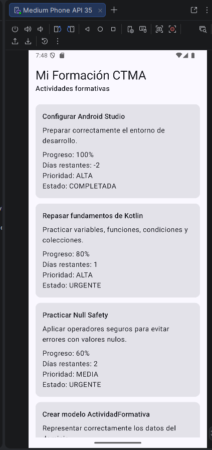
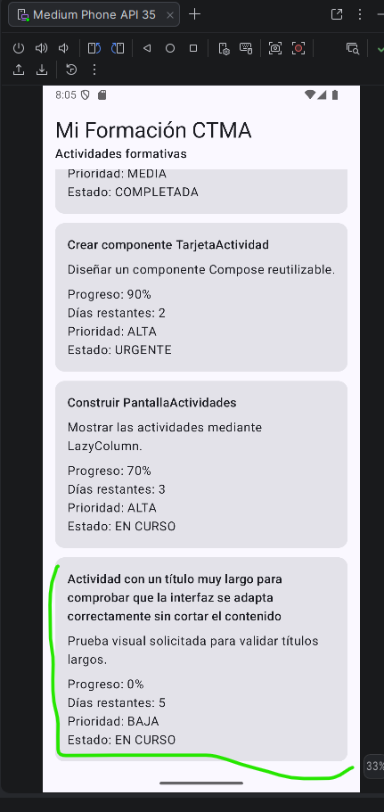
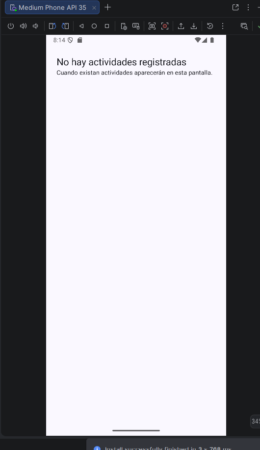
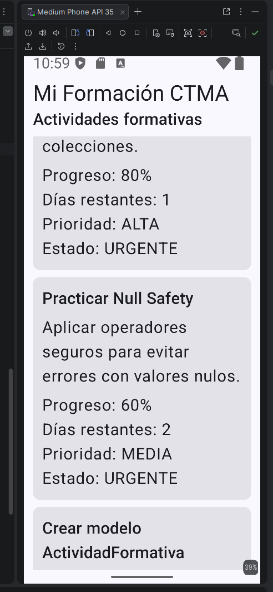
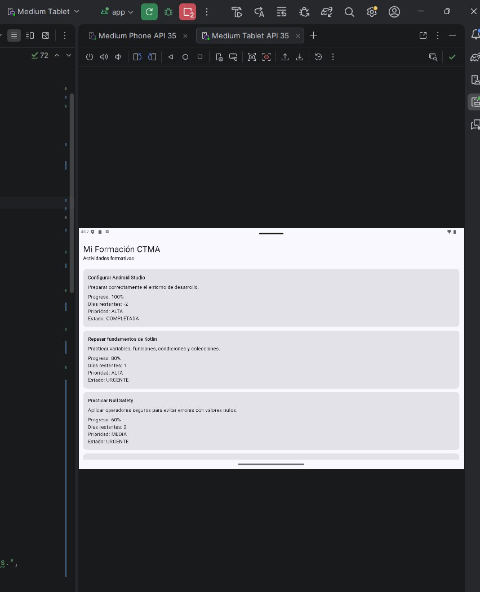

# MiFormacionCTMA2

**Primer proyecto Android - Semana 1 ADSO**

## Problema

Los aprendices manejan actividades, fechas y evidencias en diferentes canales, lo que genera olvidos y poca organización. La aplicación Mi Formación CTMA permitirá consultar compromisos y registrar avances desde el celular.

## Usuarios

* **Aprendiz:** consultar actividades y registrar avances.
* **Instructor:** publicar actividades y hacer seguimiento.

## Historias de usuario

1. Como aprendiz quiero ver mis actividades para organizar mi semana.
2. Como aprendiz quiero registrar una evidencia para controlar mis entregas.
3. Como instructor quiero publicar actividades para que los aprendices las consulten.

## Criterios de aceptación

* La lista de actividades debe mostrarse al abrir la app.
* El registro de evidencia debe guardar una descripción básica.
* Las actividades publicadas por el instructor deben ser visibles para el aprendiz.

## Tecnologías utilizadas

* Android Studio
* Kotlin
* Jetpack Compose
* Git y GitHub

---

# Semana 2 - Fundamentos de Kotlin, Scrum y Pruebas

Durante la Semana 2 se trabajaron conceptos fundamentales de Kotlin aplicados al proyecto MiFormacionCTMA2. También se aplicaron conceptos de Scrum y se realizaron pruebas unitarias para comprobar el funcionamiento de algunas reglas de negocio de la aplicación.

## Funcionalidades desarrolladas

Durante esta semana se trabajó con actividades formativas que contienen información como:

* Identificador de la actividad.
* Título.
* Descripción.
* Progreso.
* Días restantes.
* Prioridad.

También se implementaron funciones para:

* Validar el título y el progreso de una actividad.
* Determinar el estado de una actividad.
* Identificar actividades urgentes.
* Calcular el promedio de progreso.
* Buscar actividades por título.
* Ordenar las actividades.

## Scrum

Scrum es un marco de trabajo ágil utilizado para desarrollar productos de forma colaborativa e incremental mediante iteraciones llamadas Sprints.

### Roles de Scrum

* **Product Owner:** representa las necesidades del cliente, define las prioridades del producto y administra el Product Backlog.
* **Scrum Master:** facilita la aplicación de Scrum, ayuda a eliminar impedimentos y apoya al equipo.
* **Developers:** son los integrantes encargados de desarrollar y entregar el incremento del producto durante cada Sprint.

### Artefactos de Scrum

* **Product Backlog:** lista priorizada de requisitos, funcionalidades y mejoras del producto.
* **Sprint Backlog:** conjunto de tareas seleccionadas para desarrollarse durante un Sprint.
* **Incremento:** resultado funcional obtenido al finalizar el Sprint y que está listo para ser entregado.

### Ceremonias de Scrum

* **Sprint Planning:** reunión donde se define qué trabajo se realizará durante el Sprint.
* **Daily Scrum:** reunión diaria corta para revisar el avance, identificar problemas y coordinar el trabajo.
* **Sprint Review:** reunión realizada al finalizar el Sprint para presentar y revisar el incremento desarrollado.
* **Sprint Retrospective:** reunión donde el equipo analiza qué salió bien, qué puede mejorar y qué cambios aplicará en el siguiente Sprint.

## Aplicación de Scrum en MiFormacionCTMA2

Para el desarrollo del proyecto se utiliza Git y GitHub como herramientas de trabajo colaborativo.

Cada integrante puede trabajar en su propia rama para desarrollar sus actividades sin modificar directamente la rama principal del proyecto.

Mi trabajo correspondiente a esta evidencia fue realizado en la rama:

`fernando_zapa`

## Historias de usuario

Las historias de usuario utilizadas como base para el proyecto son:

1. Como aprendiz quiero ver mis actividades para organizar mi semana.
2. Como aprendiz quiero registrar una evidencia para controlar mis entregas.
3. Como instructor quiero publicar actividades para que los aprendices las consulten.

## Criterios de aceptación

* La lista de actividades debe mostrarse al abrir la aplicación.
* El registro de evidencia debe guardar una descripción básica.
* Las actividades publicadas por el instructor deben ser visibles para el aprendiz.
* El progreso de una actividad debe estar entre 0 y 100.
* El título de una actividad no puede estar vacío.

## Pruebas unitarias

Se realizaron pruebas unitarias con JUnit para comprobar el correcto funcionamiento de las reglas implementadas en Kotlin.

### Prueba positiva

Se verificó que una actividad con un título válido y un progreso dentro del rango permitido no genere errores de validación.

Ejemplo utilizado:

- Título: `Kotlin básico`
- Progreso: `80`

Resultado esperado: la lista de errores debe estar vacía.

### Prueba negativa

Se verificó el comportamiento de la aplicación cuando se ingresan datos incorrectos.

Ejemplo utilizado:

- Título vacío.
- Progreso: `120`

Resultado esperado:

- `El título es obligatorio`
- `El progreso debe estar entre 0 y 100`

### Prueba de estado de actividad

También se verificó que una actividad con progreso del 100% sea identificada como:

`COMPLETADA`

### Resultado de las pruebas

Se ejecutaron 3 pruebas unitarias y todas finalizaron correctamente:

`3 tests passed`

## Evidencias

### Ejecución de la aplicación

La aplicación fue ejecutada en un dispositivo virtual Android para comprobar el funcionamiento de la interfaz y la información correspondiente a Scrum.

### Pruebas unitarias

Se ejecutaron las pruebas unitarias del proyecto utilizando JUnit.

## Resultado Semana 2

Se logró implementar y comprobar el funcionamiento de las reglas básicas de las actividades utilizando Kotlin. Además, se documentaron los conceptos principales de Scrum y se realizaron pruebas unitarias positivas y negativas para validar el comportamiento del código.

---

# Semana 3 - Interfaces con Jetpack Compose

Durante la Semana 3 se trabajó en la construcción y validación de la interfaz gráfica de la aplicación **Mi Formación CTMA**, utilizando **Kotlin y Jetpack Compose**.

Se implementó una pantalla para visualizar las actividades formativas mediante componentes reutilizables y se realizaron diferentes pruebas para comprobar el comportamiento de la interfaz.

## Componentes implementados

- `TarjetaActividad.kt`: componente reutilizable para mostrar la información de cada actividad.
- `PantallaActividades.kt`: pantalla encargada de mostrar la lista de actividades.
- Uso de `LazyColumn` para visualizar las actividades.
- Visualización del progreso, días restantes, prioridad y estado de cada actividad.
- Manejo del estado vacío cuando no existen actividades.

## Pruebas realizadas

Durante las pruebas se verificó:

- Visualización correcta de la lista de actividades.
- Comportamiento de la interfaz con títulos largos.
- Visualización del estado vacío.
- Adaptación de la interfaz utilizando una fuente de mayor tamaño.
- Adaptación de la aplicación a una pantalla de tablet.

## Evidencias Semana 3

### 1. Lista de actividades

La aplicación muestra correctamente las actividades formativas mediante tarjetas.

### 2. Prueba con título largo

Se comprobó que las tarjetas pueden mostrar títulos extensos sin perder información.

### 3. Estado vacío

Se verificó el comportamiento de la pantalla cuando no existen actividades para mostrar.

### 4. Prueba con fuente grande

Se comprobó el comportamiento de la interfaz utilizando un tamaño de fuente mayor.

### 5. Prueba en pantalla ancha

La aplicación fue ejecutada en un dispositivo virtual **Medium Tablet API 35** para comprobar su adaptación a una pantalla de mayor tamaño.

## Resultado Semana 3

Se logró implementar una interfaz organizada mediante componentes reutilizables en Jetpack Compose. Las pruebas realizadas permitieron comprobar que la información de las actividades se visualiza correctamente en diferentes condiciones y tamaños de pantalla.
---

## Semana 7 - Corrutinas, Flow, StateFlow y ciclo de vida

El incremento de Semana 7 continúa sobre la persistencia validada en Semana 6 sin reemplazar Room ni DataStore.

### Arquitectura reactiva

`Room / DataStore -> Repository -> Flow -> ViewModel -> StateFlow -> Compose`

- Room continúa como fuente única de verdad de las actividades.
- `ActividadDataSource` desacopla el ViewModel de la implementación real y permite repositorios falsos en pruebas.
- La búsqueda usa `flatMapLatest`, por lo que una búsqueda nueva cancela la colección anterior.
- `ListadoUiState` representa exclusivamente `Cargando`, `Contenido`, `Vacio` o `Error`.
- `OperacionUiState` representa `Inactiva`, `EnCurso`, `Exitosa` o `Fallida` para guardar/editar/eliminar.
- Los flujos finales usan `stateIn(viewModelScope, SharingStarted.WhileSubscribed(5_000), ...)`.
- Compose recolecta con `collectAsStateWithLifecycle`.
- No se usa `GlobalScope`, `Thread.sleep` ni se fuerza `Dispatchers.IO` en el ViewModel.
- DataStore conserva orden, filtro de prioridad y modo de visualización.

### Pruebas Semana 7

Las pruebas unitarias usan `runTest`, repositorios falsos y tiempo virtual. Cubren transición Cargando -> Vacío, actualización reactiva tras insertar, cancelación de búsqueda obsoleta, combinación con filtro persistente y recuperación Error -> Reintentar -> Contenido.

### Decisión de dispatcher

Room y DataStore ya exponen APIs asíncronas (`suspend`/`Flow`), por lo que no se añade `Dispatchers.IO` por reflejo en el ViewModel. Si en incrementos posteriores aparece una API realmente bloqueante, la capa que la encapsule deberá hacerla main-safe e inyectar el dispatcher correspondiente.

### Uso de IA validado

Se utilizó asistencia de IA para apoyar la implementación y documentación. Cada cambio debe validarse mediante compilación, pruebas automatizadas y ejecución en Android Studio antes de fusionarse a la rama principal.

---

## Incremento acumulado Semanas 7, 8 y 9

### Semana 7 · Corrutinas y estado reactivo
- Flow/StateFlow, `viewModelScope`, `stateIn(WhileSubscribed(5_000))`.
- `ListadoUiState` y `OperacionUiState` separados.
- búsqueda cancelable con `flatMapLatest`, preferencias DataStore y `collectAsStateWithLifecycle`.
- pruebas deterministas con `runTest`, sin `Thread.sleep`.

### Semana 8 · Servicios web
- Retrofit + kotlinx.serialization + OkHttp con timeouts.
- DTO separado de Entity/dominio y `RemoteActividadDataSource`.
- Room permanece como fuente canónica; refresh transaccional y estado separado.
- token de sesión inyectado; sin credenciales reales.
- MockWebServer para 200, vacío, 401, 500, JSON inválido y timeout.

### Semana 9 · Dispositivo y seguridad
- `EvidenciaEntity`, DAO y migración v2→v3.
- Photo Picker sin permiso general de galería.
- captura con `TakePicture` + FileProvider/content URI.
- validación MIME/tamaño, vista previa, reemplazo, eliminación y sincronización.
- notificaciones solo por acción del usuario en Android 13+.
- sabores `dev`, `stage`, `prod`; producción HTTPS y sin secretos.

### Pruebas de Software y SCRUM · Semana 8
La guía paralela de automatización está en `pruebas_software_semana8/` para no mezclar Node/Vitest/Supertest con el módulo Android.

### Ejecución Android
Selecciona `devDebug` para trabajar con un backend local en `10.0.2.2:8080`. Las URLs stage/prod son marcadores `.invalid` porque las guías no proporcionan endpoints institucionales reales.
