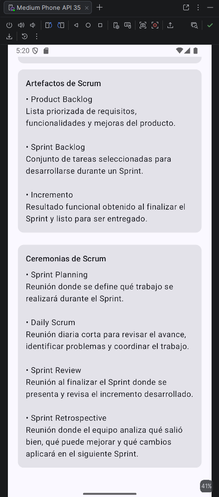
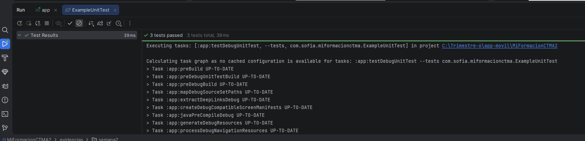

# MiFormacionCTMA2

**Primer proyecto Android - Semana 1 ADSO**

## Problema

Los aprendices manejan actividades, fechas y evidencias en diferentes canales, lo que genera olvidos y poca organización. La aplicación Mi Formación CTMA permitirá consultar compromisos y registrar avances desde el celular.

## Usuarios

* **Aprendiz:** consultar actividades y registrar avances.
* **Instructor:** publicar actividades y hacer seguimiento.

## Historias de usuario

1. Como aprendiz quiero ver mis actividades para organizar mi semana.
2. Como aprendiz quiero registrar una evidencia para controlar mis entregas.
3. Como instructor quiero publicar actividades para que los aprendices las consulten.

## Criterios de aceptación

* La lista de actividades debe mostrarse al abrir la app.
* El registro de evidencia debe guardar una descripción básica.
* Las actividades publicadas por el instructor deben ser visibles para el aprendiz.

## Tecnologías utilizadas

* Android Studio
* Kotlin
* Jetpack Compose
* Git y GitHub

---

# Semana 2 - Fundamentos de Kotlin, Scrum y Pruebas

Durante la Semana 2 se trabajaron conceptos fundamentales de Kotlin aplicados al proyecto MiFormacionCTMA2. También se aplicaron conceptos de Scrum y se realizaron pruebas unitarias para comprobar el funcionamiento de algunas reglas de negocio de la aplicación.

## Funcionalidades desarrolladas

Durante esta semana se trabajó con actividades formativas que contienen información como:

* Identificador de la actividad.
* Título.
* Descripción.
* Progreso.
* Días restantes.
* Prioridad.

También se implementaron funciones para:

* Validar el título y el progreso de una actividad.
* Determinar el estado de una actividad.
* Identificar actividades urgentes.
* Calcular el promedio de progreso.
* Buscar actividades por título.
* Ordenar las actividades.

## Scrum

Scrum es un marco de trabajo ágil utilizado para desarrollar productos de forma colaborativa e incremental mediante iteraciones llamadas Sprints.

### Roles de Scrum

* **Product Owner:** representa las necesidades del cliente, define las prioridades del producto y administra el Product Backlog.
* **Scrum Master:** facilita la aplicación de Scrum, ayuda a eliminar impedimentos y apoya al equipo.
* **Developers:** son los integrantes encargados de desarrollar y entregar el incremento del producto durante cada Sprint.

### Artefactos de Scrum

* **Product Backlog:** lista priorizada de requisitos, funcionalidades y mejoras del producto.
* **Sprint Backlog:** conjunto de tareas seleccionadas para desarrollarse durante un Sprint.
* **Incremento:** resultado funcional obtenido al finalizar el Sprint y que está listo para ser entregado.

### Ceremonias de Scrum

* **Sprint Planning:** reunión donde se define qué trabajo se realizará durante el Sprint.
* **Daily Scrum:** reunión diaria corta para revisar el avance, identificar problemas y coordinar el trabajo.
* **Sprint Review:** reunión realizada al finalizar el Sprint para presentar y revisar el incremento desarrollado.
* **Sprint Retrospective:** reunión donde el equipo analiza qué salió bien, qué puede mejorar y qué cambios aplicará en el siguiente Sprint.

## Aplicación de Scrum en MiFormacionCTMA2

Para el desarrollo del proyecto se utiliza Git y GitHub como herramientas de trabajo colaborativo.

Cada integrante puede trabajar en su propia rama para desarrollar sus actividades sin modificar directamente la rama principal del proyecto.

Mi trabajo correspondiente a esta evidencia fue realizado en la rama:

`fernando_zapa`

## Historias de usuario

Las historias de usuario utilizadas como base para el proyecto son:

1. Como aprendiz quiero ver mis actividades para organizar mi semana.
2. Como aprendiz quiero registrar una evidencia para controlar mis entregas.
3. Como instructor quiero publicar actividades para que los aprendices las consulten.

## Criterios de aceptación

* La lista de actividades debe mostrarse al abrir la aplicación.
* El registro de evidencia debe guardar una descripción básica.
* Las actividades publicadas por el instructor deben ser visibles para el aprendiz.
* El progreso de una actividad debe estar entre 0 y 100.
* El título de una actividad no puede estar vacío.

## Pruebas unitarias

Se realizaron pruebas unitarias con JUnit para comprobar el correcto funcionamiento de las reglas implementadas en Kotlin.

### Prueba positiva

Se verificó que una actividad con un título válido y un progreso dentro del rango permitido no genere errores de validación.

Ejemplo utilizado:

- Título: `Kotlin básico`
- Progreso: `80`

Resultado esperado: la lista de errores debe estar vacía.

### Prueba negativa

Se verificó el comportamiento de la aplicación cuando se ingresan datos incorrectos.

Ejemplo utilizado:

- Título vacío.
- Progreso: `120`

Resultado esperado:

- `El título es obligatorio`
- `El progreso debe estar entre 0 y 100`

### Prueba de estado de actividad

También se verificó que una actividad con progreso del 100% sea identificada como:

`COMPLETADA`

### Resultado de las pruebas

Se ejecutaron 3 pruebas unitarias y todas finalizaron correctamente:

`3 tests passed`

## Evidencias

### Ejecución de la aplicación

La aplicación fue ejecutada en un dispositivo virtual Android para comprobar el funcionamiento de la interfaz y la información correspondiente a Scrum.

### Pruebas unitarias

Se ejecutaron las pruebas unitarias del proyecto utilizando JUnit.

## Resultado Semana 2

Se logró implementar y comprobar el funcionamiento de las reglas básicas de las actividades utilizando Kotlin. Además, se documentaron los conceptos principales de Scrum y se realizaron pruebas unitarias positivas y negativas para validar el comportamiento del código.
